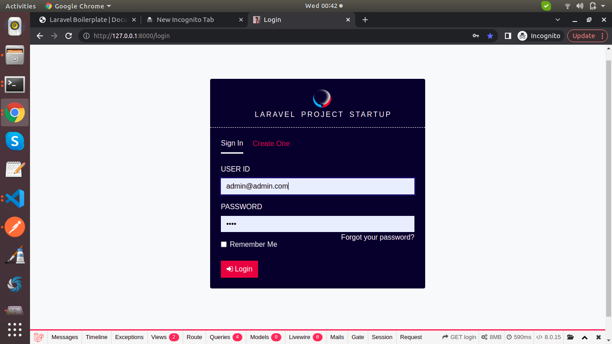
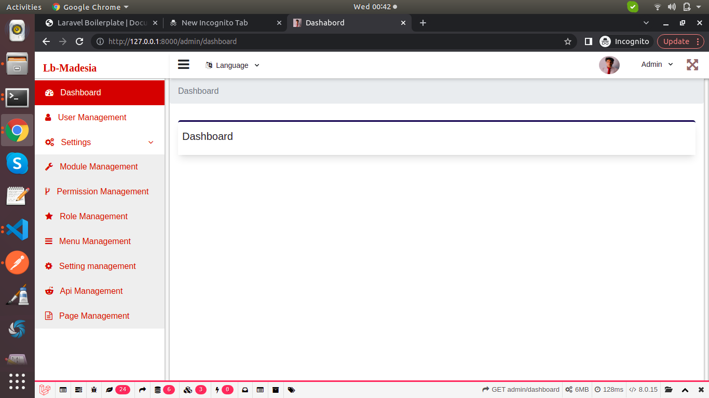
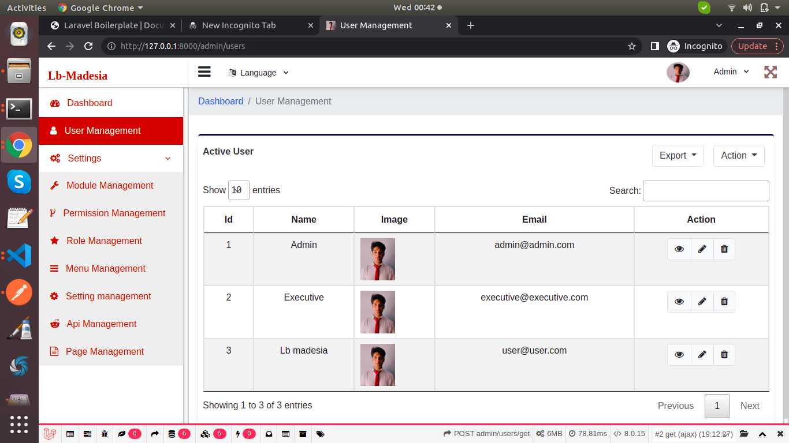
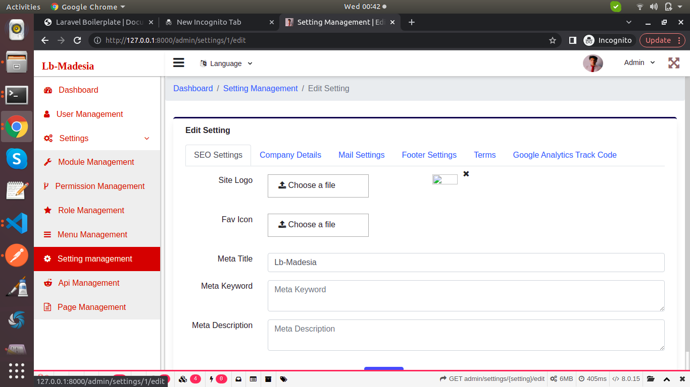

# laravel-adminpanel

## Introduction
* This is a laravel Admin Panel, based on [Rappasoft Laravel Boilerplate](https://github.com/rappasoft/laravel-boilerplate/releases/tag/v8.3.1), with enhancemenets and many modules pre-made, just for you.
* The project is taken to Laravel > 8.0 so we can develop from the latest Laravel.

## Features
For Laravel 8 Boilerplate Features : [Features](https://github.com/rappasoft/laravel-boilerplate/wiki#features)

## Additional Features
* Built-in Laravel Boilerplate Module Generator,
* Built-in Laravel Boilerplate Rest Api Generator,
* Dynamic Menu/Sidebar Builder
* Pages Module
* API Boilerplate
* Mailables
* Livewire supported
* Object based javascript Implementation
*  auto database backup
* Two Factor Authentication

Give your project a Head Start by using [laravel-adminpanel](https://github.com/lbmadesia/laravel-adminpanel).

## Built-in Laravel Boilerplate Module Generator
It gives you the ability to create a module using a sweet GUI, where you put in the Module Name and it will generate all the necessary files for you, like Model, Traits, Relationship, Migration, Controllers, Views and routes. So when you are done creating a module, you can directly go to the route generated and see your new module. Since, this does not have the ability to generate table fields for now, so you have to write the migration file that is generated and run a manual php artisan migrate command, and you are good to go.

We are using the module generator as a package, you can find it here: [Module Generator For Laravel Adminpanel](https://github.com/bvipul/generator).

## Installation

Please check the official laravel installation guide for server requirements before you start. [Official Documentation](https://laravel.com/docs/8.0/installation#installation)

Clone the repository

    git clone https://github.com/lbmadesia/laravel-adminpanel.git

Switch to the repo folder

    cd laravel-adminpanel

If you have linux system, you can execute the command below only in your project root

    1) sudo chmod -R 777 install.sh
    2) ./install.sh

Install the vendor 

    composer update

Create .env file 

     cp .env.example .env

Generate a new application key

    php artisan key:generate

Run the database migrations (**Set the database connection in .env before migrating**)

    php artisan migrate

Run the database seeders

    php artisan db:seed

run this command for publish packages view

    php artisan sweetalert:publish

    php artisan vendor:publish --tag=generator

    php artisan vendor:publish --tag=api-generator

Install the javascript dependencies using npm

    npm install

Compile the dependencies

    npm run development

For linking storage folder in public

    php artisan storage:link

Start the local development server

    php artisan serve

You can now access the server at http://localhost:8000

**Command list**

    git clone https://github.com/lbmadesia/laravel-adminpanel.git
    cd laravel-adminpanel
    cp .env.example .env
    composer install
    npm install
    npm run development
    php artisan storage:link
    php artisan key:generate
    php artisan migrate

## Please note

- To run test cases, add SQLite support to your php

## Other Important Commands
- To fix php coding standard issues run - composer format
- To perform various self diagnosis tests on your Laravel application. run - php artisan self-diagnosis
- To clear all cache run - composer clear-all
- To built Cache run - composer cache-all
- To clear and built cache run - composer cc

## Logging In

`php artisan db:seed` adds three users with respective roles. The credentials are as follows:

* Administrator: `admin@admin.com`
* Backend User: `executive@executive.com`
* Default User: `user@user.com`

Password: `1234`

## ScreenShots

## Login

## Dashboard

## User Listing

## Setting

## Issues

If you come across any issues please report them [here](https://github.com/lbmadesia/laravel-adminpanel/issues).

## Contributing
Feel free to create any pull requests for the project. For proposing any new changes or features you want to add to the project, you can send us an email at following addresses.

    (1) Manoj Kumar - manojkumarfzd254@gmail.com

# License
This api-generator is open-sourced software licensed under the MIT license
